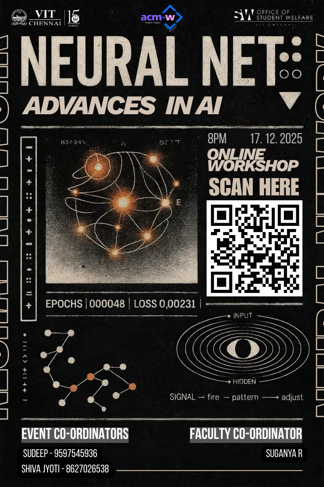

# NeuralNet-Seminar

## Overview
I was given the task to lead a group to conduct a seminar on Ethical AI.

  Which was subdivided in these topics.
  
    Lectures (AI Company Problems)
      1. Biasing 
      2. Hallucinations
      3. Risky Training
    Hand-On (User Ethical Problems)
      1. JailBreaking
      2. Security & Misuse
---
The seminar was fun and we hope everyone learned something new.
